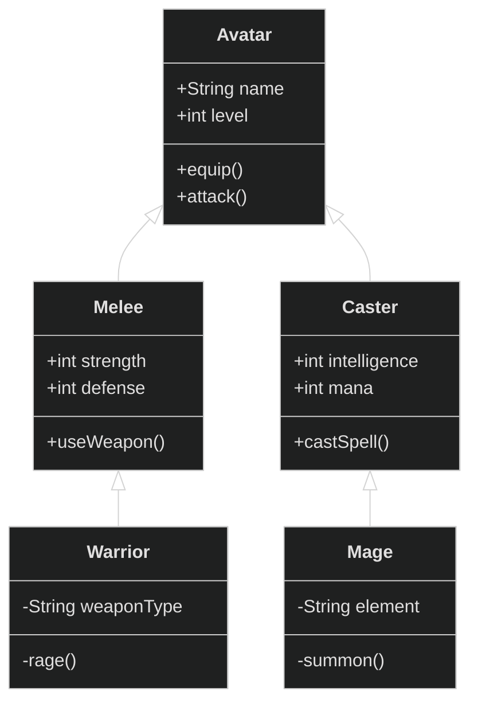
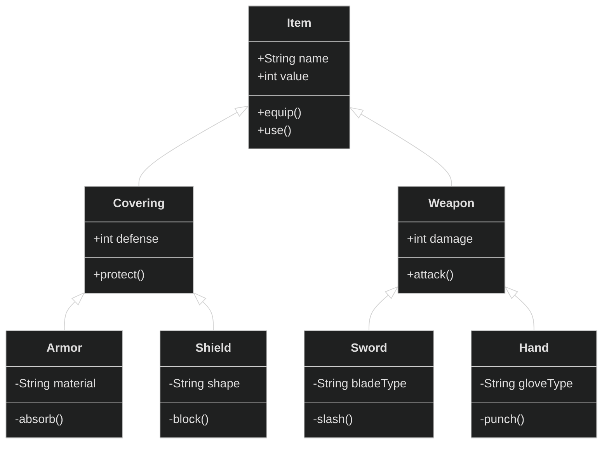

# **Practica-1-Proyecto-de-videojuego**
## >1. Introducción
### 1.1 Programación orientada a objetos
>Una compañía de videojuegos quiere comprobar el equilibrio entre los personajes de su próximo juego 
de lucha. Nos envía documentación relativa al conjunto P de N personajes del juego (PJs) y a la lógica 
del combate para que programemos distintas simulaciones y evaluemos si siempre resulta ganador 
un PJ de la misma clase. La documentación incluye varios ficheros de prueba con personajes ya 
definidos (prueba1.txt, prueba2.txt, prueba3.txt) y un main.py con código para abrir y leer los ficheros. [p1.pdf](https://github.com/OscarYT9/Practica-1-Proyecto-de-videojuego/files/10770799/p1.pdf)

### 1.2 Programación orientada a objetos

## >**2. Programas usados**

  

    
  

  

    
  

  
👀Mostrar configuración

 <ul>
    <h2>Descargar los editores de código</h2>
    <ul>
      <li><a href="https://codeSandbox.io/dashboard" target="_blank">Codesandbox</a></li>
      > En el caso de CodeSandbox no es necesario descargarlo ya que se utiliza como un simple espacio donde se almacena el proyecto que posteriormente se sube al  repostiorio de GitHub.
      <li><a href="https://code.visualstudio.com/" target="_blank">VisualStudio</a></li>
    </ul>
    
    
   <ul>
   <h2>Descargar las extensiones (en caso de trabajar con VSCode)</h2>
     <li><a href="https://marketplace.visualstudio.com/items?itemName=CodeSandbox-io.codesandbox-projects" target="_blank">CodeSandbox support in VSCode</a></li>
     > Es necesario inciar sesión (GitHub). 
     > El espacio de CodeSandbox se importa automaticamente a la extensión si formas parte del mismo. 
     > Todos los editores del repositorio tienen acceso al espacio de trabajo de CodeSandbox. 
     <li><a href="https://marketplace.visualstudio.com/items?itemName=ms-python.python" target="_blank">Python</a></li>
     > Es necesario para ejecutar codigo python (.py) en VSCode, además proporciona métodos que ayudan a la escritura y también se puede instalar en una instancia de CodeSanbox (sería necesario installar Docker para que funcione, para más info consultar el vídeo de <a href="https://www.youtube.com/watch?v=5T848HAHGfs" target="_blank">Devcontainers y Programación en la Nube</a>
  </ul>

*Proceso de configuración finalizado* 

## >**3. Flujo de trabajo**
1. Ejecutar el VSCode y utilizar la extensión de CodeSandbox, o en cuyo caso utlizar la web de CodeSandbox para acceder a la copia del repositorio.

  
  

2. Elegir la Rama, <a href="https://www.youtube.com/watch?v=tFr0Vg1q9Eg&t=609s" target="_blank">Branch</a> para trabajar sobre ella. 
En principio para este pequeño proyecto el Equipo debería trabajar sobre la misma **Rama Secundaria (draft/1)** ya que CodeSandbox permite programar en paralelo *(si el Equipo fuese más grande, entonces sería necesario crear más ramas secundarías para realizar después una selección de cambios que pasarían a la **Rama principal**)*. 

  

3. **Una vez terminado el programa actualizaremos el repositorio de GitHub:** subiremos/actualizaremos la Rama Secundaria sobre la que hemos estado trabjando en CodeSandbox a GitHub y una vez la tengamos subida a GitHub la mezclaremos con la Primaria.</u> 

  

>Para más info sobre los  diferentes métodos que proporcionan los repositorios GitHub consultar el vídeo <a href="https://www.youtube.com/watch?v=tFr0Vg1q9Eg&t" target="_blank">GIT / GITHUB ♥ Ramas o Branch, Uniones o Merge ♥</a>

## >**4. Tareas**

- [x] Crear el repositorio
- [x] Configurar el editor de texto 
- [x] Divertirse 😁

## >**5. Patrocinadores** 

