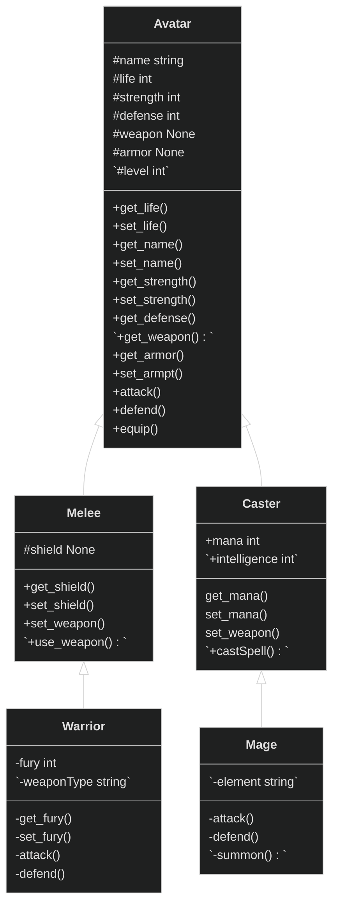
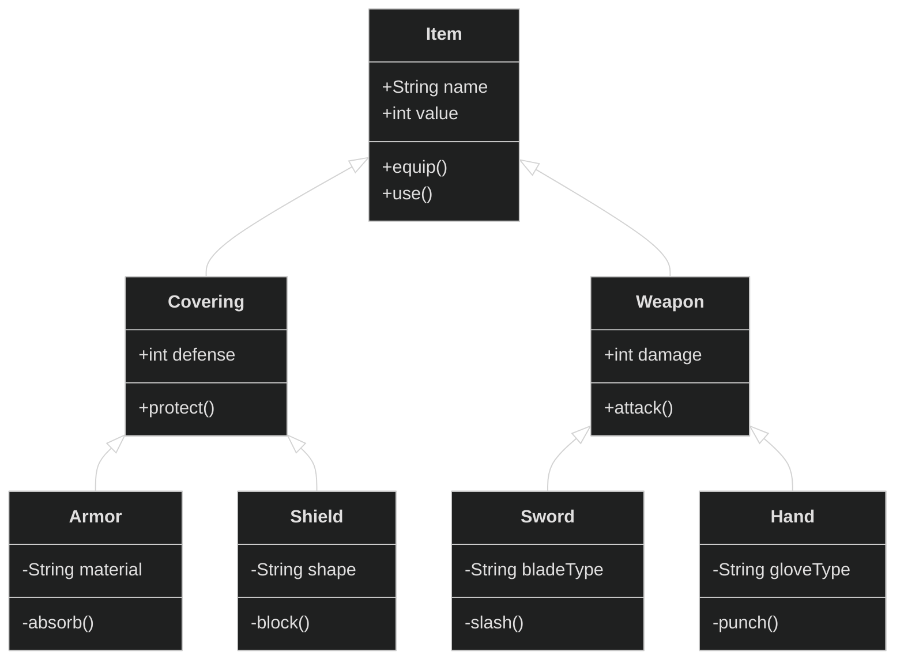

# **Practica-1-Proyecto-de-videojuego**
# 
 `Tiempo restante`  `Click para abrir` <a  href="https://codesandbox.io/p/github/OscarYT9/Practica-1-Proyecto-de-videojuego/draft/1?workspaceId=a923da0c-be0a-4c5f-a6e5-15ed3514b8c6&file=%2FREADME.md&workspace=%257B%2522activeFileId%2522%253A%2522cle8er4sd0000g4jvesqp9pcq%2522%252C%2522openFiles%2522%253A%255B%2522%252FREADME.md%2522%255D%252C%2522sidebarPanel%2522%253A%2522EXPLORER%2522%252C%2522gitSidebarPanel%2522%253A%2522COMMIT%2522%252C%2522spaces%2522%253A%257B%2522cleauevoq001d336jzl1lezqf%2522%253A%257B%2522key%2522%253A%2522cleauevoq001d336jzl1lezqf%2522%252C%2522name%2522%253A%2522Default%2522%252C%2522devtools%2522%253A%255B%255D%257D%257D%252C%2522currentSpace%2522%253A%2522cleauevoq001d336jzl1lezqf%2522%252C%2522spacesOrder%2522%253A%255B%2522cleauevoq001d336jzl1lezqf%2522%255D%252C%2522hideCodeEditor%2522%253Afalse%257D"></a> 

## 1. Introducción

  
📝Prácticas

  	

	
Práctica 1

	
### 1.1 Programación orientada a objetos
>Una compañía de videojuegos quiere comprobar el equilibrio entre los personajes de su próximo juego 
de lucha. Nos envía documentación relativa al conjunto P de N personajes del juego (PJs) y a la lógica 
del combate para que programemos distintas simulaciones y evaluemos si siempre resulta ganador 
un PJ de la misma clase. La documentación incluye varios ficheros de prueba con personajes ya 
definidos (prueba1.txt, prueba2.txt, prueba3.txt) y un main.py con código para abrir y leer los ficheros. [p1.pdf](https://github.com/OscarYT9/Practica-1-Proyecto-de-videojuego/files/10770799/p1.pdf)

### 1.2 Diagrama de clases

### 1.3 Diagrama de objetos

	
Práctica 2

	
### 1.4 Colas
>El control de vuelo de un aeropuerto necesita un nuevo programa informático que gestione el 
despegue de aviones. Este proceso se realizará siguiendo el orden establecido por una prioridad 
que viene determinada por la clase de vuelo. [Practica_2.pdf](https://github.com/OscarYT9/Practica-1-Proyecto-de-videojuego/files/11066198/Practica_2.pdf)

| Clase de vuelo | Prioridad |
| --- | --- |
| Doméstico | 1 (MAX) |
| Privado | 2 |
| Regular | 3 |
| Charter | 4 |
| Transoceánico | 5 (MIN) |

	
Práctica 3

	
### 1.5 Listas posicionales ordenadas
>En esta práctica, se simulará la gestión del servicio de préstamos de una biblioteca. De cada libro tenemos 
la  siguiente  información:  Título  del  libro,  Autor,  Año  de  edición  y Número  de  préstamos  realizados.  En  la 
actualidad, la biblioteca posee un listado ineficiente y no ordenado en el que puede haber múltiples copias 
y/o ediciones de cada libro. [P3.pdf](https://github.com/OscarYT9/Practica-1-Proyecto-de-videojuego/files/11238155/P3.pdf)
 
**Se pide implementar un sistema con menú que permita realizar las siguientes acciones:**
<ol>
  <li><strong>Leer de un fichero los datos sobre los libros y almacenarlos en una lista posicional ordenada:</strong> 
    <ul>
      <li>Los libros deben ser ordenados por autor, título y año de edición.</li>
    </ul>
  </li> 

  <li><strong>Determinar la media de préstamos por libro:</strong> 
    <ul>
      <li>Calcular el promedio de préstamos realizados por cada libro en la biblioteca.</li>
    </ul>
  </li> 

  <li><strong>Eliminar los libros con mismo título y autor:</strong> 
    <ul>
      <li>Dejar solo la versión más reciente de los libros con mismo título y autor.</li>
    </ul>
  </li> 

  <li><strong>Visualizar en pantalla un listado tabulado de libros:</strong> 
    <ul>
      <li>Se puede elegir entre todos los libros de la biblioteca, los escritos por un autor específico o los editados en un año determinado por el usuario.</li>
      <li>Si hay varias copias y/o ediciones de un libro, se deben incluir todas en el listado.</li>
    </ul>
  </li> 
</ol>

| Objetivos |
| --- |
| Las estructuras de datos deberán manipular objetos de una clase Libro, que incluirá las variables de instancia y métodos necesarios, respetando los principios de orientación a objetos (herencia, encapsulación y polimorfismo). |
| Todo el procesamiento se realizará con el TAD Lista Posicional. La práctica debe funcionar (alternativamente) con ambas implementaciones (array_ordered_positional_list y linked_ordered_positional_list). |

*Queda por implementar correctamente una función*

	
Práctica 4

### 1.6 Árboles AVL
>Dos empresas de “Actividades de Ocio” A y B han decidido fusionarse, dando lugar 
a la empresa C. Para generar su nuevo catálogo, precisan conocer la “suma de 
actividades” (las ofertadas en al menos una de las empresas) y a la “oferta mínima 
común” (las ofertadas en ambas empresas). [P4.pdf](https://github.com/OscarYT9/Practica-1-Proyecto-de-videojuego/files/12639759/P4.pdf)

- Fusión de Empresas (Empresa C)
  - Suma de Actividades
    - Actividades de la Empresa A
    - Actividades de la Empresa B
  - Oferta Mínima Común
    - Actividades Comunes a A y B
  - Datos de las Actividades
    - Actividad 1
      - Nombre: [Nombre de la Actividad 1]
      - Duración: [Duración en minutos]
      - Número de Participantes: [Número de Participantes]
      - Precio Total: [Precio Total]
    - Actividad 2
      - Nombre: [Nombre de la Actividad 2]
      - Duración: [Duración en minutos]
      - Número de Participantes: [Número de Participantes]
      - Precio Total: [Precio Total]
    - ...

## **2. Programas utilizados**

  

    
  

  

    
  

  
👀Mostrar configuración

 <ul>
    <h2>Descargar los editores de código</h2>
    <ul>
      <li><a href="https://codeSandbox.io/dashboard" target="_blank">Codesandbox</a></li>
      > En el caso de CodeSandbox no es necesario descargarlo ya que se utiliza como un simple espacio donde se almacena el proyecto que posteriormente se sube al  repostiorio de GitHub. Aunque igualmente existe un <a href="https://github.com/codesandbox/codesandbox-client" target="_blank">cliente de escritorio</a> para mayor comodidad.
      <li><a href="https://code.visualstudio.com/" target="_blank">VisualStudio</a></li>
    </ul>
    
    
   <ul>
   <h2>Descargar las extensiones (en caso de trabajar con VSCode)</h2>
     <li><a href="https://marketplace.visualstudio.com/items?itemName=CodeSandbox-io.codesandbox-projects" target="_blank">CodeSandbox support in VSCode</a></li>
     > Es necesario inciar sesión (GitHub). 
     > El espacio de CodeSandbox se importa automaticamente a la extensión si formas parte del mismo. 
     > Todos los editores del repositorio tienen acceso al espacio de trabajo de CodeSandbox. 
     <li><a href="https://marketplace.visualstudio.com/items?itemName=ms-python.python" target="_blank">Python</a></li>(Ya está instalado en el entorno de trabajo de CodeSandbox) 
     > Es necesario para ejecutar codigo python (.py) en VSCode, además proporciona métodos que ayudan a la escritura y también se puede instalar en una instancia de CodeSanbox (sería necesario installar Docker para que funcione, para más info consultar el vídeo de <a href="https://www.youtube.com/watch?v=5T848HAHGfs" target="_blank">Devcontainers y Programación en la Nube</a>)
	   <ul>

>**Opcional** *(Estos cambios ya están aplicados al entorno de trabajo de CodeSandbox):*
De normal VSCode no actualiza el código en tiempo real, sino que solo lo actualiza cuando sales de la vista del código, para modificar su comportamiento debes ir a Configuración> Remoto> Files:Auto Save y cambiar el `onFocusChange` por el `afterDealy`
	
	Tambien se puede cambiar el tiempo (ms) que tarda en actualizarlo con `files.autoSaveDelay`
	   
	<!--P.D: los cambios en el VSCode solo aparecen una vez que minimizas la aplicación o el que está en el CodeSanbox sale de la vista del código.(Esto no está muy claro tengo que seguir provando)-->
		   
  </ul>

*Proceso de configuración finalizado* 

## **3. Flujo de trabajo**
1. Ejecutar el VSCode y utilizar la extensión de CodeSandbox, o en cuyo caso utlizar la web de CodeSandbox para acceder a la copia del repositorio.

  
  

2. Elegir la Rama, <a href="https://www.youtube.com/watch?v=tFr0Vg1q9Eg&t=609s" target="_blank">Branch</a> para trabajar sobre ella. 
En principio para este pequeño proyecto el Equipo debería trabajar sobre la misma **Rama Secundaria (draft/1)** ya que CodeSandbox permite programar en paralelo *(si el Equipo fuese más grande, entonces sería necesario crear más ramas secundarías para realizar después una selección de cambios que pasarían a la **Rama principal**)*. 

  

3. **Una vez terminado el programa actualizaremos el repositorio de GitHub:** subiremos/actualizaremos la Rama Secundaria sobre la que hemos estado trabjando en CodeSandbox a GitHub y una vez la tengamos subida a GitHub la mezclaremos con la Primaria.</u> 

  

>Para más info sobre los  diferentes métodos que proporcionan los repositorios GitHub consultar el vídeo <a href="https://www.youtube.com/watch?v=tFr0Vg1q9Eg&t" target="_blank">GIT / GITHUB ♥ Ramas o Branch, Uniones o Merge ♥</a>

## **4. Tareas**
- [x] Crear el repositorio
- [x] Configurar el editor de texto 
- [x] Divertirse 😁

## **5. Colaboradores**
<table>
<tr><td align="center"><a href="https://github.com/ggarciaengelmo"> <b>ggarciaengelmo</b></a>  <a href="https://github.com/OscarYT9/Practica-1-Proyecto-de-videojuego/commits?author=ggarciaengelmo" title="Code">💻</a></td>
<td align="center"><a href="https://github.com/OscarYT9"> <b>OscarYT9</b></a>  <a href="https://github.com/OscarYT9/Practica-1-Proyecto-de-videojuego/commits?author=OscarYT9" title="Code">💻</a></td></tr>
</table>

## **6. Patrocinadores** 

<a href="https://codesandbox.io/p/github/OscarYT9/Practica-1-Proyecto-de-videojuego/draft/1?workspaceId=a923da0c-be0a-4c5f-a6e5-15ed3514b8c6&file=%2FREADME.md&workspace=%257B%2522activeFileId%2522%253A%2522cle8er4sd0000g4jvesqp9pcq%2522%252C%2522openFiles%2522%253A%255B%2522%252FREADME.md%2522%255D%252C%2522sidebarPanel%2522%253A%2522EXPLORER%2522%252C%2522gitSidebarPanel%2522%253A%2522COMMIT%2522%252C%2522spaces%2522%253A%257B%2522cleauevoq001d336jzl1lezqf%2522%253A%257B%2522key%2522%253A%2522cleauevoq001d336jzl1lezqf%2522%252C%2522name%2522%253A%2522Default%2522%252C%2522devtools%2522%253A%255B%255D%257D%257D%252C%2522currentSpace%2522%253A%2522cleauevoq001d336jzl1lezqf%2522%252C%2522spacesOrder%2522%253A%255B%2522cleauevoq001d336jzl1lezqf%2522%255D%252C%2522hideCodeEditor%2522%253Afalse%257D">
  
</a>

        

	 
##  **7. Referencias** 
<a href="https://www.youtube.com/@Dimasmas/videos" target="_blank">@Dimasmas</a> [^1]

<a href="https://www.youtube.com/@FaztCode/videos" target="_blank">@FaztCode</a> [^2]

<a href="https://www.youtube.com/@EDteam/videos" target="_blank">@EDteam</a> [^3]

<a href="https://www.youtube.com/@AntonioSarosi/videos" target="_blank">@AntonioSarosi</a> [^4]

<a href="https://www.youtube.com/@bluuweb/videos" target="_blank">@bluuweb</a> [^5]

<a href="https://www.youtube.com/@CodeSandbox/videos" target="_blank">@CodeSandbox</a> [^6]

<a href="https://www.youtube.com/@BitBoss/videos" target="_blank">@BitBoss</a> [^7][^8]

<a href="https://www.youtube.com/@MrPSolver/videos" target="_blank">@MrPSolver</a> [^9]

[^1]: **<a href="https://www.youtube.com/watch?v=Ji8uoRvi17s" target="_blank"> # ❗PRINCIPIO de la Programación Orientada a Objetos: ABSTRACCIÓN - [EN PYTHON] - Curso PYTHON de cero</a>**

[^2]: **<a href="https://www.youtube.com/watch?v=pmVx7Ic3ITE" target="_blank"> # Github CodeSpaces, Visual Studio Code en la nube</a>**

[^3]: **<a href="https://www.youtube.com/watch?v=G2LphORsbLw" target="_blank"> # ¿Cómo programar desde la nube sin instalar editores de código?</a>**

[^4]: **<a href="https://www.youtube.com/watch?v=5T848HAHGfs" target="_blank"> # Devcontainers y Programación en la Nube. ¿Es el Futuro?</a>**

[^5]: **<a href="https://www.youtube.com/watch?v=tFr0Vg1q9Eg" target="_blank"> # GIT / GITHUB ♥ Ramas o Branch, Uniones o Merge ♥ [ Tutorial en Español - Parte 3]</a>**

[^6]: **<a href="https://www.youtube.com/watch?v=HfPIhxWacfs" target="_blank"># How to import a GitHub repository on CodeSandbox | CodeSandbox 101</a>**

[^7]: **<a href="https://www.youtube.com/watch?v=SI7O81GMG2A" target="_blank"># Programación Orientada a Objetos (POO): Abstracción, Encapsulamiento, Herencia, Polimorfismo</a>**

[^8]: **<a href="https://www.youtube.com/watch?v=JVNirg9qs4M" target="_blank"># CLASES en PYTHON, TODOS los pilares de POO aplicados a un EJEMPLO COMPLETO desde CERO</a>**

[^9]: **<a href="https://www.youtube.com/watch?v=0MhVkKHYUAY" target="_blank"># New Python Coders Be Like...</a>**
